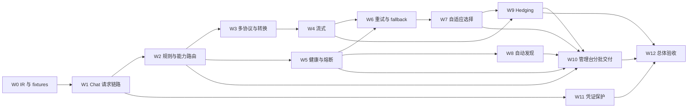

# 后续功能详细实施计划

编制日期：2026-09-06；最终验收：2026-09-13。W0–W12 的 92 项任务已完成，功能状态见 [roadmap.md](roadmap.md)，命令、环境、测试映射、截图和有界负载结果见 [验收记录](verification/acceptance.md)。

交付范围是本计划定义的首版协议子集：Chat、Anthropic、无状态 Responses 客户端，通过统一 IR 和显式 Binding 访问 Chat Completions 上游。媒体 IR 中预留的 reasoning、audio、video、document，以及原生 Anthropic/Responses 上游推理，不属于本轮支持的传输能力。

下文保留原定实施顺序、阶段性约束和验收目标；测试按领域和共享集成环境合并，实际测试类映射以验收记录为准。W1.8 的临时流式/高级策略限制已随 W4/W7 完成解除。

目标是完成 Phase 2–12 和 roadmap 列出的横向工作，使三个客户端协议能够通过统一 IR、显式 Binding 和可观测的执行流程访问 Provider。Phase 1 的持久化、管理界面和手动模型导入作为后续实现的基础。

## 1. 规划时的基线与缺口（2026-09-06）

Phase 1 于 2026-09-06 完成后端、前端、Docker 和浏览器验收。下表保留制定计划时的代码状态，用于说明任务来源；这些缺口已在本轮实现和验收中处理，不表示当前仍未完成。

| 规划时的代码状态 | 对实施计划的影响 |
| --- | --- |
| W0.1/W0.2/W0.3 已实现类型化内容、请求校验、工具与 usage 契约，以及带消息/内容/工具关联、结束原因和安全错误的流事件及顺序校验 | 继续补齐适配器契约与 fixtures，再写协议转换与 SSE |
| `ClientProtocolAdapter.parse(RequestContext)` 是同步方法，而上下文只有 HTTP 请求、请求头和请求 ID | 明确响应式读取请求体与纯协议解析的边界，避免为了满足接口而调用 `block()` |
| `GatewayWebFilter` 仅保护 `/api/admin` | 第一条推理接口上线时同步补充认证和协议错误响应 |
| `ModelRouter`、`HealthManager`、`CircuitBreaker` 只有接口 | Chat 首次打通需要先实现配置读取、候选过滤和确定性选择；高级评分随后接入 |
| `model_rules` 没有目标 Virtual Model 关联；规则和策略没有管理服务/API | 先定义规则语义并迁移 schema，规则与策略界面才能实际控制路由 |
| Binding 保存时尚未校验协议转换关系；能力 JSON 只校验数组形状 | 管理写入校验与请求时兼容性校验都需要实现 |
| 手动同步先读取完整目录，再通过 Provider 行锁串行写入 | 调度器还需解决跨实例执行、过期快照覆盖、移除与重现，不能只增加定时注解 |
| Provider 密钥在 API 中脱敏，但数据库仍存储明文 | 单独安排加密、历史数据迁移和轮换，并覆盖推理、连接测试、模型发现三条使用路径 |
| Prometheus 依赖存在，当前文档未列出具体业务指标名称 | 本计划提出指标清单，实施时先写入架构文档，再固定名称、标签和统计口径 |

后端路径约定：下文 `model/`、`protocol/` 等相对于 `backend/src/main/java/com/llmgateway/`；新增后端测试放在 `backend/src/test/java/com/llmgateway/`，协议样例放在 `backend/src/test/resources/fixtures/`。现有文件按需修改，新增类型名可在不改变职责的前提下调整。

## 2. 交付顺序与依赖

按可验收能力组织工作包，不机械地按 roadmap 的 Phase 编号串行执行。第一条请求路径依赖 Phase 7 的基础路由；Phase 7 的健康过滤和评分又依赖 Phase 8，因此分步接入。

| 工作包 | 对应范围 | 主要交付 | 前置依赖 |
| --- | --- | --- | --- |
| W0 | Phase 2 | IR、协议支持边界、fixtures 和执行上下文 | Phase 1 |
| W1 | Phase 3；Phase 7 基础；横向错误/日志 | Chat 非流式端到端路径 | W0 |
| W2 | Phase 7；Phase 12 的管理 API | 能力检查、通配规则、完整候选解析、规则/策略 CRUD | W1 |
| W3 | Phase 4、5；Phase 2 兼容性验收 | Anthropic / Responses 客户端接入和 Binding 转换 | W2 |
| W4 | Phase 6 | Chat Provider SSE 解码、三个客户端 SSE 编码、取消传播 | W3 |
| W5 | Phase 8；Phase 7 的健康/延迟评分 | Redis 健康、熔断、指标和查询 API | W2；流式统计联调依赖 W4 |
| W6 | 横向 retry / fallback | 统一错误策略、预算、退避和候选耗尽行为 | W4、W5 |
| W7 | Phase 9 | 自适应评分、首选 Binding 和失效处理 | W6 |
| W8 | Phase 10 | 自动发现调度和模型生命周期 | W2、W5 |
| W9 | Phase 11 | 延迟并发请求、胜者选择和取消 | W4、W6、W7 |
| W10 | Phase 12 | 规则、策略、健康、发现、仪表盘界面 | 分别随 W2、W5、W7、W8、W9 交付 |
| W11 | 横向凭证保护 | 存储加密、历史迁移、轮换 | W1；最终回归覆盖 W8 |
| W12 | 全阶段验收 | 集成场景、运行文档、部署与状态更新 | W0–W11 |



建议设置五个验收节点：W1 完成后验证单协议推理；W3/W4 完成后验证多协议和流式；W5/W6/W7 完成后验证稳定性与选路；W8/W9/W10 完成后验证自动运维与管理能力；W11/W12 完成后验证生产凭证与完整回归。W5、W8、W11 的独立工作可以在满足依赖后交错推进；图中的交付依赖不代表省略各工作包的联调验收。

## 3. 先固定的行为约定

以下约定作为首版建议，在对应工作包中落实到文档、类型和测试，避免同一概念在多个模块出现不同解释。

| 事项 | 建议约定 |
| --- | --- |
| 模型名 | 客户端填写逻辑模型名；先查精确 Virtual Model，再匹配规则；出站使用 `ProviderModel.modelName`，响应保持请求的逻辑名称 |
| 精确命中但被禁用 | 明确拒绝请求，不再通过通配规则绕过禁用状态 |
| 优先级 | 数值越小越优先；相同优先级使用稳定的次级排序，禁止依赖数据库默认返回顺序 |
| 通配语法 | 大小写敏感、整串匹配；`*` 匹配任意长度，`?` 匹配单个字符，其余字符按字面量处理；不开放任意正则 |
| Binding 协议 | `sourceProtocol` 必须等于入口协议；`targetProtocol` 必须等于所选 Provider 协议；跨协议时必须显式开启转换且存在可用适配链 |
| 能力覆盖 | `capabilitiesOverride = null` 继承模型声明，显式数组替换模型声明；最终仍与 Provider 适配器及转换链支持能力取交集，覆盖不能让未实现的协议功能变得可用 |
| 重试与 fallback | retry 在同一 Binding 上重试，fallback 切换到下一个未耗尽的候选；两者使用同一个总 deadline 和物理请求次数预算 |
| Hedging 数量 | `maxHedgeCount` 表示额外请求数，0 表示无额外请求；首版支持最多 2 个额外请求，即总计最多 3 个并发候选 |
| 流式承诺点 | 首个客户端 SSE 事件发出后，固定响应来源；后续错误按当前协议终止，不能重试后拼接另一条回答 |
| 统计单位 | 一次客户端调用是一个逻辑请求；每次真实上游调用是一个 attempt；重试、fallback、hedge 均生成独立 attempt |
| 模型发现 | 手动接口默认继续执行目录合并；自动发现执行完整快照对账；只有确认完整、成功的目录才能作为缺失判据 |
| 配置与运行态 | MySQL 保存拓扑、策略、发现元数据和加密凭证；Redis 保存健康、熔断、分数、偏好、调度租约及有限时间窗口统计 |

## 4. 详细工作包

### W0：IR、协议契约和测试样例

涉及 `model/`、`protocol/ClientProtocolAdapter.java`、`protocol/RequestContext.java`、`provider/ProviderContext.java`，新增 `inference/` 下的请求与执行上下文。

- [x] W0.1 将 `ContentBlock` 收敛为 sealed interface 与不可变 record 变体，覆盖 text、image、thinking、tool call/result，以及 audio、video、document 的类型化载荷。JSON 仅保留给工具参数、JSON Schema 等本身开放的数据结构；为图像等内容区分 URL、内联数据和 MIME 类型。
- [x] W0.2 完善消息、工具选择、工具调用关联、生成参数、结构化响应格式、结束原因和 usage。明确必填字段、空值、非负 token 数、工具调用 ID 关联、参数互斥和输入大小约束；usage 缺失表示未知，不用 0 伪造结果。
- [x] W0.3 补齐流事件中的消息 ID、内容块索引、工具调用 ID/名称、参数增量、结束原因和安全错误。定义合法顺序、多个工具交错输出及增量 JSON 尚未闭合时的表示方式。
- [x] W0.4 HTTP 层用 `bodyToMono` 读取类型化请求 DTO；适配器执行纯解析和编码。使用泛型或各协议的明确 DTO 消除 `Mono<Object>` / `Flux<Object>` 的模糊返回契约；SSE 使用明确的事件载荷和 `ServerSentEvent` 边界。
- [x] W0.5 执行上下文保存 request ID、入口协议、逻辑模型名、解析后的 Virtual Model、deadline、attempt ID 和 Binding ID；路由接口显式接收所需上下文。出站模型名单独保存，避免改写共享 IR 导致多候选并发污染。
- [x] W0.6 建立 fixtures 清单：请求 JSON、规范化 IR、上游响应 JSON、预期客户端响应、原始 SSE 字节片段、预期 IR 事件、安全错误。每份样例注明协议版本、支持特性和预期拒绝原因，全部使用合成数据。
- [x] W0.7 在 `docs/protocol.md` 固定首版支持矩阵。类型中预留媒体能力不代表协议已经支持；未知或不能保持语义的参数必须有显式拒绝样例。首版 Chat 的多候选输出等未建模特性也应明确限制。

验收：新增 `LlmRequestValidationTest`、`ContentBlockTest`、`LlmStreamEventContractTest`，覆盖合法组合、非法组合、不可变性、工具关联和使用量缺失。W0 完成类型及 fixture 基线，Phase 2 的完整兼容性验收还需 W1/W3 的真实适配器通过这些样例。

W0.1 已于 2026-09-06 完成：`ContentBlockTest` 和 `MediaSourceTest` 共 65 项测试通过，覆盖八类载荷、URL/内联数据、MIME 校验、工具参数深复制及结果列表不可变性；当时 `./gradlew test` 全量 96 项通过，包含 11 项 MySQL/Redis 管理 API 集成测试，无跳过项。

W0.2 已于 2026-09-06 完成：新增 `LlmRequestValidationTest`、`GenerationConfigTest`、`JsonSchemaTest` 和 `LlmResponseValidationTest`，共 109 项测试覆盖消息角色、并行工具结果关联、工具选择、参数互斥、Schema 不可变性、结束原因、缺失/部分 usage、溢出及输入大小边界；`./gradlew test` 全量 205 项通过，包含上述 11 项 MySQL/Redis 集成测试，无跳过项。首版约束和大小计量方式见 [protocol.md](protocol.md)。该次验收时 Phase 2 为 `Partial`；最终状态见 roadmap。

W0.3 已于 2026-09-06 完成：`LlmStreamEvent` 改为 sealed interface 与不可变 record 变体，新增 `LlmStreamError` 和 `LlmStreamEventValidator`。`LlmStreamEventContractTest` 共 122 项测试通过，覆盖消息/内容/工具关联、合法顺序、多工具交错、未闭合 JSON 分片、结束时完整对象校验、缺失/部分 usage、安全错误、提前 EOF 和有界参数缓冲；`./gradlew test` 全量 327 项通过，包含上述 11 项 MySQL/Redis 集成测试，无跳过项。事件顺序与限制见 [protocol.md](protocol.md)。该次验收时 Phase 2 为 `Partial`，Phase 6 为 `Contract only`。W0.4–W0.7、真实 SSE 编解码和协议兼容性验收已在 2026-09-13 的最终验收中完成。

### W1：Chat Completions 非流式请求链路

新增 `protocol/chat/`、`provider/chat/`、`inference/InferenceService.java`、`routing/DefaultModelRouter.java` 和运行配置读取边界；修改 `GatewayWebFilter`。配置读取返回领域对象，复用响应式 repository，通过映射层与 `admin` 的 HTTP DTO 解耦。

- [x] W1.1 实现 `POST /v1/chat/completions` 的请求 DTO、客户端适配器和响应编码器，覆盖文本、多轮消息、已声明支持的图像输入、工具调用/结果、生成参数与结构化输出。
- [x] W1.2 为推理入口接入 gateway 认证、请求体大小限制、安全 request ID 和 Reactor Context。Chat/Responses 使用 gateway bearer key；W3 接入 Anthropic 时支持其客户端认证方式，提供的仍是 gateway key。
- [x] W1.3 根据精确名称查找 Virtual Model，读取关联 Binding、Provider、Provider Model。仅允许启用的 Virtual Model/Binding/Provider 和 `ACTIVE` 模型；检查入口/目标协议和请求所需基础能力，再按优先级、ID 选择候选。配置读取失败不能表现为“模型不存在”。
- [x] W1.4 实现 Chat Provider 请求编码、真实 WebClient HTTP 执行和响应解码。复用现有目录访问的 URL/认证约定，将共享部分抽成传输配置；覆盖 base URL 带 `/v1`、尾斜杠和子路径的情况。仅发送明确允许的请求头。
- [x] W1.5 落实连接、读取和总请求超时及响应大小限制。总 deadline 从请求进入开始计算；单次执行不得超过剩余预算。鉴权密钥按 Provider 注入出站请求，绝不转发客户端 gateway key。
- [x] W1.6 建立中立的错误分类：请求错误、能力不兼容、Provider 认证失败、限流、模型不存在、网络失败、超时、上游服务错误、非法响应和候选耗尽。各客户端适配器编码自己的错误体；不返回上游原始正文、URL 参数或凭证。
- [x] W1.7 加入逻辑请求和 attempt 生命周期钩子，记录请求次数、结果、耗时以及结构化安全日志。首版先采用一次出站调用，W6 在同一执行边界增加重试和 fallback。
- [x] W1.8 将 `stream=true` 的暂不支持行为显式化，在 W4 完成前返回已文档化错误；未交付的路由策略也要明确拒绝。将初始可执行的默认策略设为 `PRIORITY`，W7 完成后再允许配置 `ADAPTIVE`。

验收：`ChatCompletionsAdapterTest`、`ChatProviderAdapterTest`、`ChatInferenceIntegrationTest` 使用本地 HTTP fixture 与隔离 MySQL/Redis 跑通完整路径。证明入站逻辑名称被映射为真实模型名、Provider key 正确使用、响应名称正确、禁用/不兼容候选零出站请求，并覆盖 401、404、429、5xx、超时、非法 JSON 和凭证不泄漏。HTTP fixture 请求计数必须与 attempt 数一致。

### W2：能力、通配规则、候选解析和策略配置

涉及 `routing/`、`model/ModelRule.java`、`model/RoutingPolicy.java`、`admin/BindingService.java`、`admin/VirtualModelService.java`；新增规则/策略 entity、repository、service、controller，以及 Flyway 迁移。

- [x] W2.1 实现 `RequestCapabilityExtractor` 与 `CapabilityChecker`，从消息、工具、输出格式、reasoning、stream 等实际请求内容推导需求，再与 Binding 的有效能力比较。错误列出缺失的能力名称，不包含请求内容。上下文长度等数值限制需要明确来源，不能仅由模型名称或字符串长度猜测。
- [x] W2.2 给 `model_rules` 增加 `virtual_model_id` 外键，规则只把请求名解析为已配置的 Virtual Model。已有无目标规则保持不可执行，迁移不猜测目标；API 在启用规则时要求有效关联。
- [x] W2.3 实现 `WildcardMatcher`、`VirtualModelResolver`。规则按 priority 升序、字面量字符数降序、创建时间升序、ID 升序排序；相同 pattern 与 priority 却指向不同目标的启用规则在管理写入时拒绝。为 pattern 和模型名设置长度边界，避免复杂模式造成不可控匹配开销。
- [x] W2.4 将路由拆成候选解析、配置状态过滤、协议/能力过滤、运行态过滤、评分、选择。W2 完成前两类过滤及 `PRIORITY`；W5 接入健康/熔断和 `LATENCY`、`HEALTH`，W7 接入 `ADAPTIVE`。保留每个候选被排除的安全原因，供日志与路由预览使用。
- [x] W2.5 实现 `/api/admin/model-rules`、`/api/admin/routing-policies` CRUD，补齐 Virtual Model 的策略引用校验、删除引用冲突和乐观锁。策略设置覆盖全局默认，Provider 的超时/重试配置仍在总执行预算内生效。
- [x] W2.6 校验 Binding 的能力枚举、source/target、Provider 协议一致性、转换开关和适配器可用性。Provider 协议修改也检查现有 Binding；存量不一致配置返回修复清单，并在路由时排除。
- [x] W2.7 提供 `/api/admin/routing/preview`，只接受模型名、入口协议和所需能力，返回解析结果、候选、过滤原因和排序依据。预览不得请求 Provider、修改偏好或消耗半开熔断探测名额。
- [x] W2.8 定义配置生效语义：通过短只读事务或带版本复核的聚合查询取得一致配置快照，读取结束即释放事务；开始物理请求前复核候选状态/版本。初期直接查询数据库，增加缓存时必须同时实现提交后失效通知、版本检查和 TTL，覆盖多实例漏收通知的情况。

验收：`WildcardMatcherTest`、`VirtualModelResolverTest`、`CapabilityCheckerTest`、`ModelRouterTest` 和规则/策略 API 集成测试。覆盖精确匹配优先、禁用精确名称、通配冲突、无匹配、空候选、能力覆盖、错误模型归属、未知能力、优先级稳定性和配置更新后的候选失效。此时 Phase 7 仍待 W5 的运行态过滤与评分验收。

### W3：Anthropic / Responses 接入与可配置转换

新增 `protocol/anthropic/`、`protocol/responses/` 和转换兼容性检查器，复用 Chat Provider adapter。按 roadmap 的范围，先完成以下三条非流式适配链。

| 客户端入口 | Provider 协议 | 本阶段行为 |
| --- | --- | --- |
| `POST /v1/chat/completions` | `CHAT_COMPLETIONS` | 同协议编解码 |
| `POST /v1/messages` | `CHAT_COMPLETIONS` | Anthropic → IR → Chat；返回 Anthropic 格式 |
| `POST /v1/responses` | `CHAT_COMPLETIONS` | Responses → IR → Chat；返回 Responses 格式 |

- [x] W3.1 分别实现 Anthropic、Responses 的类型化请求解析、完整响应编码、安全错误编码和入口认证；固定所支持协议版本及必要版本头。Anthropic 入口接受 `x-api-key` 携带 gateway key，多个认证头冲突时拒绝；认证失败也按入口协议输出错误。
- [x] W3.2 对 system/developer 消息、内容块顺序、工具调用 ID 与结果、结构化输出、停止原因、reasoning 和 usage 建立逐项转换表。每项标为无损支持、满足条件才支持或拒绝，并有正反样例。
- [x] W3.3 Responses 首版以显式请求内容完成无状态调用。不能由当前 IR 和 Chat Provider 表达的服务端会话引用、后台执行、内置工具等能力明确拒绝；Anthropic 的专有内容或控制参数同样按兼容矩阵处理。
- [x] W3.4 实现适配器注册表和 `TranslationValidator`；配置保存与请求执行都检查整条链是否存在。对能力缺失、无法等价表示的角色/工具/内容和参数组合，在出站前返回可诊断错误，禁止静默删字段或字符串替换。
- [x] W3.5 根据 Binding 的 source/target/translationEnabled 执行转换；相同 Virtual Model 的不同入口可命中不同 Binding。原生 Anthropic/Responses Provider 推理适配器若另行扩展，必须新增独立任务和 fixtures，不能因协议枚举或目录读取已支持而宣称推理可用。
- [x] W3.6 将 W0 样例接入三个真实客户端适配器，验证 IR 到各客户端的语义一致性；对工具、图像、结构化输出等有条件支持项，同时验证能力允许与能力拒绝两条路径。

验收：`AnthropicAdapterTest`、`ResponsesAdapterTest`、`TranslationCompatibilityTest`、`MultiProtocolInferenceIntegrationTest`。同一合成对话经三种入口访问 Chat fixture 后产生预期的上游请求，并返回各自协议规定的响应；关闭转换、目标协议不一致和不支持的字段均零出站请求。通过后才更新 Phase 2、4、5 的完整状态。

### W4：SSE 流式传输与取消

涉及 `model/LlmStreamEvent*`、`provider/chat/`、三个客户端协议包和 `inference/` 的流式执行分支。

- [x] W4.1 实现增量 SSE framing 与 Chat chunk 解码，处理网络分片、多行 data、CRLF、注释/心跳、空 delta、终止标记、usage 尾块及中途错误。JSON 只在完整 SSE 事件组装后解析。
- [x] W4.2 将工具调用按 index/ID 关联到 IR 事件；参数增量按顺序保留，不对尚未完成的 JSON 片段执行完整对象校验。工具参数完整后再校验，错误不能被当成正常完成。
- [x] W4.3 分别实现 Chat、Anthropic、Responses SSE 编码器，生成各协议需要的事件名、顺序、消息/内容块 ID、结束事件和终止格式。usage 缺失、提前 EOF、错误事件都有明确处理规则。
- [x] W4.4 保持从 WebClient 到 HTTP response 的响应式消费和有界缓冲；禁止收集整条流后再返回。限制单事件大小、工具参数累计大小和待发送队列，并为慢客户端设置明确的超时/终止行为。
- [x] W4.5 客户端断开、总 deadline、读取超时和下游取消必须传递到上游订阅，并释放连接、缓冲区、定时器和后续熔断许可。客户端取消单独统计，不算 Provider 失败。
- [x] W4.6 在首个 SSE 事件提交前保留 HTTP 错误处理能力；提交后只能发送该协议允许的错误/结束事件或关闭连接。已经输出的文本不得通过 fallback 接续其他 Provider 的内容。
- [x] W4.7 区分首个传输事件、首个有效内容事件的时间和完整响应耗时。空 role delta、心跳和元数据不能计为 TTFT，也不能在 W9 中触发胜者选择。

验收：`ChatSseDecoderTest`、三个客户端的 `SseEncoderTest`、`StreamingInferenceIntegrationTest`。对固定 SSE 样例按单字节、事件边界和混合大小切片，输出相同 IR；覆盖多个工具交错、UTF-8 分片、usage、空回答、异常 EOF、超限数据和慢消费。通过真实 HTTP 连接关闭观测上游取消；通过虚拟时间验证超时，避免依赖长时间 sleep。取消后没有新增事件、连接泄漏或未结束的后台任务。

### W5：Redis 健康状态、熔断和可观测性

涉及 `health/`、`resilience/`、`infrastructure/RedisKeyNamespace.java`、`config/ResilienceProperties.java`，新增 Redis 实现、Micrometer 指标及管理查询 API。

- [x] W5.1 用类型化 `AttemptOutcome` 替代当前 `recordFailure(bindingId, boolean timeout)` 无法表达的结果信息，区分成功、Provider 错误、限流、请求错误、客户端取消和 hedge 取消。每个 attempt 只能结算一次，逻辑请求在最终结束时单独结算。
- [x] W5.2 实现 Provider、Binding、Provider Model 的 Redis 健康快照，包含成功/失败/超时计数、连续失败、最近成功/失败时间、有效内容首帧与整体延迟。定义统计窗口、样本下限、过期时间和 `UNKNOWN` 冷启动行为。
- [x] W5.3 Binding 是默认熔断粒度，Provider/模型聚合健康用于观测和明确配置的过滤规则；单个 Binding 故障不能无条件封禁整个 Provider。用 Lua/原子更新维护单个状态对象，避免多实例读改写覆盖；跨 key 的聚合允许短暂延迟，不能假设跨 Redis hash slot 原子执行。
- [x] W5.4 实现 `CLOSED → OPEN → HALF_OPEN → CLOSED/OPEN`。阈值、冷却时间、半开并发数和恢复条件可配置，沿用现有 8 次失败、30 秒冷却作为初始默认。取得半开许可与状态判断必须原子化；许可取消/超时必须释放或过期。
- [x] W5.5 请求错误、能力拒绝、客户端取消和 hedge loser 取消不增加熔断失败；Provider 限流使用独立限流观察/暂避时间，避免与服务故障混用。成功到达首帧不能算完整请求成功，流中断需要记录失败。
- [x] W5.6 接入路由健康过滤、熔断检查和 `LATENCY`/`HEALTH` 排序。筛选阶段只读取状态，在即将真正出站时取得许可；管理预览、候选排序不能提前消耗探测名额。
- [x] W5.7 明确 Redis 故障行为：新请求若无法判断必要的熔断状态，默认返回可诊断的 503；已经执行中的请求正常收尾，统计写入失败不能覆盖成功响应。调度器无法取得租约时暂停新任务。未来若支持静态路由降级，作为显式配置并单独验收。
- [x] W5.8 提供 `/api/admin/health` 和 `/api/admin/health/bindings/{id}` 等查询，返回状态、样本时间、过期标识及安全错误分类。W10 的短窗口仪表盘从有限数量的 Redis 时间桶读取；Prometheus 用于外部采集，前端不直接解析 scrape 文本。
- [x] W5.9 将指标、日志字段、采样与过期规则写入 `docs/architecture.md` 和新的运行说明。保护 Prometheus 等含运行信息的端点，保留部署健康检查所需的访问方式。

建议固定以下 Prometheus 导出名称；Micrometer 内部名称与导出后缀的映射由测试确认。

| 指标 | 类型与统计对象 |
| --- | --- |
| `llm_gateway_requests_total` | Counter；逻辑请求，按入口协议、stream 和最终 outcome 分类 |
| `llm_gateway_request_duration_seconds` | Histogram/Timer；逻辑请求完整耗时 |
| `llm_gateway_provider_attempts_total` | Counter；物理请求，含首次、retry、fallback、hedge 及其 outcome |
| `llm_gateway_provider_duration_seconds` | Histogram/Timer；物理请求完整耗时 |
| `llm_gateway_provider_ttft_seconds` | Histogram/Timer；流式首个有效内容延迟，无有效内容时不伪造样本 |
| `llm_gateway_tokens_total` | Counter；仅累计上游已报告的 token，按 input/output 和必要的统计范围区分 |
| `llm_gateway_retries_total`、`llm_gateway_fallbacks_total` | Counter；实际启动的重试和候选切换 |
| `llm_gateway_circuit_transitions_total`、`llm_gateway_circuit_state` | Counter + Gauge；状态迁移与当前状态 |
| `llm_gateway_hedges_started_total`、`llm_gateway_hedges_won_total`、`llm_gateway_attempt_cancellations_total` | Counter；W9 接入并区分取消原因 |
| `llm_gateway_discovery_runs_total`、`llm_gateway_discovery_duration_seconds` | Counter + Timer；W8 接入目录同步结果 |

标签只允许固定枚举和受控数量的配置标识，不使用 request ID、原始模型输入、URL、异常全文或内容文本。删除配置时清理对应动态 meter，避免标签无限增长。逻辑响应 usage 与所有已知 attempt usage 分开统计；被取消请求的实际计费未知时保持未知。

结构化日志允许字段为 request ID、attempt ID、virtualModelId、bindingId、providerId、入口/目标协议、路由原因代码、耗时、重试序号和安全结果码。request ID 需要长度/字符校验；禁止记录 prompt、completion、请求/响应原文、Authorization、API key，以及自动包含这些字段的对象 `toString()`。

验收：`RedisHealthManagerIntegrationTest`、`RedisCircuitBreakerIntegrationTest`、`GatewayMetricsTest`、`RequestLoggingTest`。使用两个服务实例共享 Redis 验证失败计数、并发半开许可、取消释放、TTL 和故障恢复；证明单次 attempt 不重复结算。精确验证失败阈值、冷却到期、成功恢复、流中断、取消不惩罚和 Redis 不可用行为，并确认日志与指标中没有合成敏感标记。

### W6：统一 retry、fallback 和候选耗尽行为

新增 `resilience/RetryPolicy.java`、`resilience/AttemptBudget.java` 及执行协调器，修改 `inference/`，复用 W1 的错误分类和 W5 的结算边界。

- [x] W6.1 将 `Provider.maxRetries` 定义为同一 Binding 的额外重试次数；增加路由级 `maxTotalAttempts`、总 deadline、退避上限和 jitter。每次实际出站都原子扣减总次数，包括未来的 hedge。
- [x] W6.2 在每次重试前检查剩余时间、取消状态、候选版本、熔断许可及重放条件。连接尚未建立的失败可按策略重试；已发送的生成请求可能重复执行，只有显式允许重放或 Provider 支持已验证的幂等机制时才重试。
- [x] W6.3 限定 `Retry-After` 等待时间，采用有上限的指数退避和 jitter。解析协议/校验输入失败不进入 `retryWhen`；不得通过多层重试操作符让请求数成倍增长。
- [x] W6.4 当前 Binding 重试次数耗尽或属于可切换故障时，选择下一个未耗尽且仍合格的候选。维护已尝试集合，禁止 A/B 来回循环；没有候选时只产生一次逻辑失败。
- [x] W6.5 在首个 SSE 提交后禁止 retry/fallback；开始响应前可以按同一预算切换。客户端取消同时终止当前调用、退避等待和待启动候选。
- [x] W6.6 固定对外错误优先级：总 deadline 耗尽返回 504；全部候选限流返回 429，并仅给出安全且有界的重试提示；无健康/可用候选返回 503；Provider 认证配置或非法响应导致耗尽返回安全 502。不同入口使用自己的错误 envelope。

| 错误类别 | 同 Binding retry | 切换候选 | 对健康/熔断的影响 |
| --- | --- | --- | --- |
| 请求格式错误、gateway 认证失败 | 否 | 否 | 不记录 Provider 失败 |
| 能力/转换不兼容 | 否 | 出站前继续筛选 | 不记录 Provider 失败；所有候选均不兼容时返回明确客户端错误 |
| Provider 401/403 | 否 | 可以 | 标记凭证/配置不可用，配置修复后失效重查；对外不伪装为客户端认证失败 |
| Provider 模型 404 | 否 | 可以 | 使相关候选/缓存失效；不能仅凭一次推理错误删除数据库模型 |
| Provider 429 | 有预算且允许重放时 | 可以 | 限流计数和暂避，不默认累加服务故障熔断阈值 |
| 连接失败、网络错误、超时、可恢复 5xx | 满足重放与预算条件时 | 满足重放条件时 | 记录对应物理失败；超时单独分类 |
| Provider 400/422 | 否 | 仅在确认属于候选特定限制时 | 通用输入错误直接终止，不能盲目遍历全部 Provider |
| 非法响应、协议不完整 | 默认否 | 响应尚未提交且允许重放时 | 记录 Provider 协议失败 |
| 客户端取消、hedge loser 取消 | 否 | 否 | 单独记录取消，不算故障 |

例如总预算为 3、A 的 `maxRetries=1` 时，可以执行 A 首次、A 重试、B fallback；第三次后即耗尽，B 自身的重试配置不能再增加调用。fallback 同样可能重复生成，需要执行与 retry 相同的重放判断。

验收：`RetryFallbackPolicyTest`、`AttemptBudgetTest`、`RetryFallbackIntegrationTest`。用虚拟时间和 HTTP fixture 请求计数覆盖可恢复错误、不可恢复错误、Retry-After 超过预算、连接前/发送后失败、候选被禁用、取消、全部失败和流式承诺点，确认物理调用次数严格不超过预算。

### W7：自适应 Provider 选择与首选 Binding

涉及 `routing/`、`health/`、`model/RoutingPolicy.java` 及现有 preferred/score Redis 命名空间。

- [x] W7.1 建立可解释的评分公式：`score = wSuccess × successEWMA + wLatency × latencyScore + wHealth × healthScore - wFailure × decayedPenalty`；延迟评分可采用 `1 / (1 + observedLatency / targetLatency)`。权重、采样下限、衰减和目标延迟持久化为策略配置并校验范围。
- [x] W7.2 流式选择使用 TTFT 样本，非流式使用完整耗时，避免混合比较；完整成功率仍以最终结束结果计算。没有样本的候选使用中性先验和受限探索，不因未知延迟为 0 而永久排在首位。
- [x] W7.3 所有评分发生在硬性状态、协议、能力和熔断过滤之后。实现 `AdaptiveBindingScorer`，在相同分数时使用确定性 priority/ID 顺序，并提供可查看的评分分项。
- [x] W7.4 在 `preferred:virtual-model:{id}` 中保存 Binding ID、配置版本、更新时间和 TTL。读取首选时重新验证本次请求兼容性；当前请求能力不匹配时跳过该首选，不因此全局删除仍可服务其他请求的偏好。
- [x] W7.5 实现冷启动、最少样本、切换优势阈值和最短保持时间，限制短期波动引起的频繁切换。失败、OPEN、配置删除/禁用、模型移除和关联版本变化触发结构性失效。
- [x] W7.6 分数和首选更新采用原子比较/更新，过期 attempt 不得把已经禁用或修改的 Binding 重新设为首选。失败惩罚随时间衰减；客户端/hedge 取消不参与故障惩罚。

验收：`AdaptiveBindingScorerTest`、`PreferredBindingIntegrationTest`。模拟快但不稳定、慢但稳定、新增候选、突发失败与恢复；验证最低样本量、衰减、TTL、抖动抑制、请求能力差异和多实例并发更新。健康/能力不合格候选即使历史分数最高也不得出站。

### W8：自动模型发现与生命周期对账

复用 `HttpProviderModelDiscovery` 和现有事务导入，新增 `DiscoveryScheduler`、按 Provider 协调的同步服务、运行状态 DTO 和迁移；修改 `ProviderOperationsService`、`DiscoveryProperties`、Provider Model 元数据及管理查询。

- [x] W8.1 按全局开关、Provider.enabled、modelDiscoveryEnabled 和间隔选择到期任务，Provider 间隔优先于默认间隔。实现启动错峰、任务并发上限、失败退避、运行中修改间隔/禁用和关闭应用时的取消。手动同步继续允许对禁用 Provider 显式执行。
- [x] W8.2 手动与自动任务共用按 Provider 协调器，多实例通过 owner token、TTL、续租和单调递增 fencing generation 避免重复执行。generation 由 MySQL 持久化计数分配，避免 Redis key 过期/重启后回退。HTTP 读取不占用长数据库事务；写入时校验 generation，失去租约的旧任务不能提交过期快照。
- [x] W8.3 同 Provider 的手动请求在有界等待内串行处理，并保留现有同步成功响应语义；等待超时返回明确忙碌结果。不同 Provider 可并发。自动调度不能因一次任务异常停止扫描其他 Provider。
- [x] W8.4 只有所有分页都成功且目录结构通过校验后才执行对账事务。增加缺失观察次数、首次缺失时间、最近观察 generation、移除来源和移除前状态；缺失默认经过两次成功完整快照确认后才移除。失败快照既不增加缺失次数，也不更改模型状态。
- [x] W8.5 完整空目录同样需要两次成功确认；重复 cursor、分页中途失败、超时、数据库回滚和被新 generation 替代的快照都不能移除模型。现有手动默认合并路径不执行缺失移除，自动对账结果另外报告 missing/removed/reappeared 计数。
- [x] W8.6 同一模型重新出现时复用 ID、firstSeenAt、人工名称、能力和 Binding；按下表恢复状态。人工修改与自动事务冲突时使用版本/锁检查，重新读取人工意图，不能覆盖期间的禁用操作。
- [x] W8.7 在事务成功后失效相关路由缓存、模型缓存和偏好；模型移除仅改变可用状态，不物理删除引用。目录同步成功不等于推理健康成功，不能据此关闭推理熔断器。
- [x] W8.8 提供每个 Provider 的最近尝试/成功、下次运行、耗时、创建/更新/移除数、当前租约/任务状态和安全失败码。运行状态写入专用 Redis key，经 `RedisKeyNamespace` 生成；只有生命周期元数据进入 MySQL。

| 当前情况 | 自动对账中的建议状态变化 |
| --- | --- |
| 首次发现模型 | 创建为 `NEW`，能力为空，等待管理配置 |
| `ACTIVE` 或 `NEW` 持续存在 | 保留人工配置，只刷新目录元数据和 lastSeenAt |
| `ACTIVE` 或 `NEW` 缺失达到确认阈值 | 记录此前状态，设为 `REMOVED`，来源为自动发现 |
| 自动移除的模型重新出现 | 恢复到记录的 `ACTIVE` 或 `NEW`；前提是之后没有人工状态变更 |
| 人工 `DISABLED` 的模型缺失或重新出现 | 保持 `DISABLED`，独立更新目录是否存在的元数据 |
| 人工 `REMOVED` 的模型重新出现 | 保持 `REMOVED`，由管理员明确恢复 |

验收：`DiscoverySchedulerTest`、`DiscoveryReconciliationIntegrationTest`、`DiscoveryConcurrencyIntegrationTest`。覆盖全局/Provider 开关、间隔变更、两实例抢占、租约过期、旧快照迟到、分页失败、空目录、两次缺失、重新出现、人工禁用和事务回滚。原有手动同步的保留能力/状态、重复导入、并发串行与失败无部分写入测试继续通过。

### W9：Hedged Requests

新增 `resilience/HedgedRequestExecutor.java`，复用 W6 的总预算、错误策略、候选快照和 W5 的许可/结算机制。

- [x] W9.1 仅在策略明确开启且允许重放时启动 hedge。立即执行首选候选；在 `hedgeDelay` 到期、仍没有胜者且预算允许时启动第二候选，再经过一个 delay 启动第三候选。默认仍关闭，额外并发最多 2。
- [x] W9.2 所有并发分支选择不同 Binding，并重新校验启用状态、能力和熔断许可；候选不足、剩余 deadline 不足或次数预算耗尽时不再派发。多个 Binding 指向同一 Provider、真实模型和协议链时按实际出站目标去重。
- [x] W9.3 非流式以首个通过协议校验的完整成功响应为胜者；某一分支先报错不阻止其他分支成功。全部分支失败且没有待启动候选时才返回逻辑失败。
- [x] W9.4 流式以首个可输出的有效内容事件选胜者，包括有效文本、可表示的 thinking 或工具调用事件；心跳、role 空增量、MESSAGE_START 和单独 usage 不算。合法空回答以正常结束事件完成选择。选定前的控制事件有界缓冲，之后只输出胜者的事件序列。
- [x] W9.5 每个 attempt 只订阅一次；首事件探测与后续输出消费同一条上游流，不能为了接续输出重新发起 HTTP 请求。以原子终结状态处理同一时刻成功、deadline、客户端取消和新 hedge 到期的竞争。
- [x] W9.6 选定胜者后立即取消其他分支及待触发定时器，释放连接和半开许可。胜者在已经提交客户端事件后失败时按流式协议结束，不能切回 loser。
- [x] W9.7 retry、fallback、hedge 由同一协调器管理。首分支快速失败时可立即选择下一个候选；待触发 hedge 不能再次启动已经选择的候选，更不能为每个 hedge 递归开启新 hedge。
- [x] W9.8 补齐 hedge 启动、获胜、取消、额外 attempt 和已知 usage 指标；区分客户取消与竞争失败取消。取消动作不能被当成“上游一定停止计费”的证据。

验收：`HedgedRequestExecutorTest`、`HedgedStreamingIntegrationTest`。覆盖首选在 delay 前成功、第二/第三候选获胜、首分支先失败、所有分支失败、元数据先到但内容较慢、工具首事件、合法空回答、同时成功、取消与 timer 竞争、候选不足、全局预算耗尽和半开许可释放。HTTP fixture 证明只出现一个客户端响应源、attempt 数不超预算且 loser 连接取消。

### W10：完整管理台

涉及 `frontend/src/App.vue`、`frontend/src/components/`、`frontend/src/types/`、`frontend/src/stores/` 和新增后端查询接口。页面按能力交付拆分；可复用状态留在 Pinia store。

- [x] W10.1 规则页支持 pattern、目标 Virtual Model、优先级、启停、冲突提示和匹配预览；策略页支持策略选择、各评分参数、retry/fallback 总预算及 hedge 设置。未实现或不满足约束的配置在前后端都拒绝保存。
- [x] W10.2 Virtual Model 编辑页选择已存在策略；Binding 编辑页展示协议链和可用能力，给出具体不兼容原因。新增功能保持现有编辑、凭证保留、保存后刷新失败的行为可用。
- [x] W10.3 健康页展示 Provider/模型/Binding 状态、熔断状态、样本时间、成功率、TTFT/完整延迟和首选原因。过期、未知和 Redis 不可用应有对应状态；读页面不修改熔断或评分。
- [x] W10.4 发现管理显示开关、间隔、运行中/等待、最近成功/失败、下次执行、导入/缺失/移除/重现数量，提供现有手动同步入口，并解释模型状态变化来源。
- [x] W10.5 仪表盘接入 `/api/admin/dashboard`，展示有限窗口的请求量、成功率、延迟分布、可用候选、熔断数量、fallback/hedge 情况和已知 token 用量。时间窗口必须与 Redis 保存的时间桶一致，百分位基于直方图合并计算，不能平均已有 p95。
- [x] W10.6 拆分配置加载和运行数据轮询，避免任一健康查询失败导致整套 CRUD 不可用；实现取消过期请求、离开页面停止轮询、请求去重、加载/空状态/错误反馈。长期历史查询不使用不存在的数据填充图表。
- [x] W10.7 扩展 `frontend/tests/` 的 Playwright 场景，使用可控推理/目录 fixture 驱动状态变化；为新增可见页面生成截图，并在 `docs/development.md` 中记录复现步骤。

验收：`npm --prefix frontend run build` 和浏览器测试通过。覆盖规则/策略 CRUD、引用删除冲突、配置真正影响下一次推理、故障触发熔断后的界面变化、发现失败恢复和模型重现；复跑现有 CRUD、密钥保留与刷新失败恢复场景。浏览器响应、DOM 和截图中不出现 Provider 明文密钥。

### W11：生产凭证存储与迁移

新增凭证解析/加解密边界，修改 Provider 持久化映射、Provider 出站认证、目录访问、配置和 Flyway 迁移。首版完成存储加密路线，凭证解析接口为外部 Secret Manager 来源预留扩展点。

- [x] W11.1 使用经过维护的标准密码库完成带认证的加密，例如 AES-256-GCM；密文 envelope 包含版本、key ID、随机 nonce 和认证标签，AAD 绑定 Provider ID。密钥来自部署注入的密钥文件或外部密钥服务，不写入源码、数据库或日志。
- [x] W11.2 增加足够长度的密文列，避免现有 `api_key VARCHAR(1024)` 无法容纳加密后的最大长度输入。API 继续只显示已配置状态/掩码；省略、null、`***`、替换和显式清除均通过统一凭证服务处理。
- [x] W11.3 实施扩展式迁移：先加列并部署可读取新旧格式的版本；所有实例具备读密文能力后启用加密写入；批量加密历史明文并使用版本检查避免覆盖并发更新；验证遗留明文数量归零后关闭旧格式读取。
- [x] W11.4 历史迁移任务可恢复、可统计、可重复执行，错误仅报告记录 ID 和安全原因。Flyway 只改变 schema，不在 SQL 中嵌入密钥执行数据加密。迁移期间保留兼容版本作为回退目标，禁止通过解密回写明文实现回滚。
- [x] W11.5 支持写新 key ID、读旧 key ID 的密钥轮换，完成重新加密和验证后再退役旧 key。错误密钥、篡改密文、缺失 key ID 或密钥服务不可用时停止对应出站调用，返回安全配置错误。
- [x] W11.6 推理、连接测试、手动/自动发现共用凭证解析；避免将明文凭证放入可打印的共享配置快照。生产配置验证加密材料和 gateway key，拒绝空 gateway key 或仓库开发默认值；开发/测试继续使用隔离的显式配置。

验收：`CredentialEncryptionTest`、`CredentialMigrationIntegrationTest`、`CredentialRotationTest`。证明最大长度凭证可保存、数据库没有遗留明文、相同 key 重复加密 nonce 不同、跨 Provider 密文替换失败、轮换前后可用及三条出站使用路径正确；原有管理密钥保留/替换/清除测试按新存储契约更新并继续通过。

### W12：总体验收与交付文档

2026-09-13 验收通过：后端 20 个测试套件共 432 项，零失败、零跳过；前端 production build、4 个浏览器场景、生产配置的空数据库 Compose 启动及 78 次有界负载请求通过。修复了 MySQL 初始化临时 socket 服务导致健康检查过早通过的问题，启动依赖现在检查最终 TCP 端口。共享运行态并发由两个独立组件实例连接真实 MySQL/Redis 验证；具体测试层级和边界见 [验收记录](verification/acceptance.md)。

- [x] W12.1 用隔离 MySQL/Redis 和本地 HTTP fixture 组成完整场景：三协议入口、文本/工具/结构化输出、stream/non-stream、通配模型名、能力过滤、retry/fallback、熔断恢复、首选切换、发现移除/重现和 hedge 取消。
- [x] W12.2 加入两实例共享 Redis 的集成场景，验证半开许可、偏好并发、发现租约/旧快照拒绝、配置变更生效和运行态过期。系统时钟/调度器可注入，时间行为优先通过虚拟时间测试。
- [x] W12.3 验证升级前 V1 数据经新增迁移后仍能完成 CRUD 和推理配置；运行新建数据库和已有数据升级两类测试。现有 `AdminApiIntegrationTest` 中“成功迁移数等于 1”的断言改为验证预期迁移版本和实际 schema；清理顺序覆盖新增规则/策略外键。
- [x] W12.4 执行有界的并发与慢流验证，记录连接池、内存、取消延迟、超时和并发数。固定请求规模与 fixture 延迟后再设定性能门槛，不把 Provider 外网波动混入网关自身验收。
- [x] W12.5 更新 README、architecture、protocol、routing、provider、model-discovery、development 文档，补充生产配置、指标口径、错误分类、迁移/密钥轮换和故障排查。每个阶段验收记录包含命令、环境、结果及必要截图。
- [x] W12.6 逐项更新 roadmap 状态：只有运行行为与对应验收均通过才改成 `Implemented`；跨工作包能力尚未结束时保留 `Partial`。本计划的任务完成勾选不能替代 roadmap 的阶段验收。

后端功能变更按仓库要求运行 `./gradlew test`；前端变更至少运行 production build。最终验收命令如下，Docker/浏览器参数沿用 [development.md](development.md) 的隔离测试方式。

```bash
./gradlew test
./gradlew build
npm --prefix frontend ci
npm --prefix frontend run build
docker compose config --quiet
# 启动专用测试栈后执行，设置 GATEWAY_URL、PROVIDER_FIXTURE_HOST 和测试 gateway key。
npm --prefix frontend run test:e2e
```

单元测试验证领域行为；真实 HTTP fixture 验证编解码、网络错误和连接取消；Testcontainers 验证事务/迁移/Redis 原子性；浏览器验证配置到实际请求行为的闭环。测试不得依赖真实 Provider 凭证或真实计费请求。

## 5. 数据库与配置变更清单

所有 schema 变更新增 `V2__...sql` 及后续 Flyway 文件，版本号按实际合入顺序确定，不修改已经应用的 `V1__init.sql`。

| 变更 | 主要字段/约束 | 兼容与验收要求 |
| --- | --- | --- |
| 规则关联，W2 | `model_rules.virtual_model_id` 外键、版本及必要索引 | 旧规则缺少目标时先禁用；新启用规则必须关联有效 Virtual Model；删除引用返回 409 |
| 策略能力，W2/W5/W6/W7/W9 | 总 deadline、总 attempt 数、退避、评分、熔断覆盖、hedge 上限等类型化配置及版本 | 只保存已支持参数；全局/策略/Provider 的优先关系固定；默认不开 hedge；新执行链默认 PRIORITY |
| 生命周期，W8 | 缺失次数/时间、观察 generation、移除来源、移除前状态；Provider 的已分配/已应用 generation | 新字段有安全初值；存量人工 DISABLED/REMOVED 不被自动恢复；旧快照不能覆盖新状态 |
| 凭证，W11 | 加密 envelope 列及必要版本信息 | 先扩展 schema，再完成应用切换、数据加密与旧格式退出；单独验证轮换与回退 |

JSON 字段仅用于清晰定义过的开放结构，不将完整策略塞入无类型 Map。能力字符串数组升级为受枚举约束的值，未知值需给出安全校验错误。所有新增 duration、阈值、权重、并发和次数配置在启动或管理写入时校验；非法值不能悄悄被默认值覆盖。

建议首版采用以下可测试默认值。表中的新增配置名表达领域含义，实际配置绑定在对应工作包确定；生产取值再依据运行指标调整。

| 配置 | 初始值 | 说明 |
| --- | --- | --- |
| 全局路由策略 | `PRIORITY` | 首条执行链可用后生效；高级策略经各自验收后开放 |
| 逻辑请求总 deadline | 60 秒 | 新增全链路上限；单次调用取此剩余时间与 Provider timeout 的较小值 |
| `maxTotalAttempts` | 3 | W6 新增，包含首次、retry、fallback、hedge |
| Provider `maxRetries` | 0 | 沿用现有默认；提高次数仍受总预算约束 |
| 已发送请求的重放许可 | 关闭 | W6 新增；允许重试、fallback 或 hedge 产生重复生成时显式开启 |
| hedge 开关 / delay / 额外次数 | 关闭 / 800ms / 1 | 沿用已有字段默认；额外次数合法范围为 0–2 |
| 熔断连续失败 / cooldown / 半开并发 | 8 / 30 秒 / 1 | 前两项沿用当前配置；半开许可控制新增 |
| 发现默认间隔 / 缺失确认次数 | 30 分钟 / 2 | Provider 间隔优先；确认次数仅由成功完整快照推进 |

新增 Redis key 必须通过 `RedisKeyNamespace`，约定 TTL、数据版本、删除配置后的清理及 Redis 不可用行为。配置提交后再发布失效事件，数据库回滚时不发布；Redis Pub/Sub 不能单独承担可靠失效，读取时仍需版本/TTL 兜底。

## 6. roadmap 覆盖与完成条件

| roadmap 未完成项 | 负责工作包 | 可以标为完成的关键证据 |
| --- | --- | --- |
| Phase 2：IR invariant、内容类型、协议 fixtures 与兼容性 | W0、W1、W3 | 类型化 IR 与校验测试；真实适配器通过跨协议正反样例 |
| Phase 3：Chat 客户端/Provider、HTTP、错误映射 | W1 | 鉴权后的真实 HTTP 非流式端到端测试 |
| Phase 4：Anthropic / Responses | W3 | 两种独立客户端适配器通过 Chat Provider 转换链路 |
| Phase 5：Binding 转换与能力损失拒绝 | W2、W3 | 配置/运行双重检查；不兼容请求零出站调用 |
| Phase 6：SSE 与取消 | W4 | 三客户端编码、Provider 解码、分片、工具和真实连接取消测试 |
| Phase 7：能力、通配、过滤与基础评分 | W1、W2、W5 | resolver、checker、状态/熔断过滤、PRIORITY/LATENCY/HEALTH 行为测试 |
| Phase 8：健康、指标与熔断 | W5 | Redis 并发状态机、可配置阈值、故障行为和业务指标测试 |
| Phase 9：偏好、评分与失效 | W7 | 自适应选择、衰减、冷启动、TTL、版本失效与防抖测试 |
| Phase 10：调度、移除/重现 | W8 | 两实例调度与完整生命周期测试，失败快照不移除模型 |
| Phase 11：延迟并发、胜者、取消、指标 | W9 | 次/第三候选成功、单胜者、预算、取消和竞态测试 |
| Phase 12：规则、策略、健康、发现、仪表盘 | W10 及对应后端工作包 | 前端 build、浏览器场景和截图，配置实际影响请求路径 |
| 统一错误分类与 retry | W1、W6 | 错误分类矩阵、退避/重放约束和调用次数断言 |
| retry/fallback 分离与候选耗尽 | W6、W9 | 同一预算、已尝试集合、取消、最终错误优先级测试 |
| 请求/Provider 指标与结构化日志 | W1、W5、W8、W9 | 逻辑/物理请求口径、取消分类、标签限制及脱敏验证 |
| 协议/流式/路由/发现/hedge 测试套件 | W0–W10、W12 | 对应行为测试及跨模块场景全部通过 |
| 生产 secret 加密或外部集成 | W11 | 存储加密、历史明文清零、轮换与凭证使用路径验证 |

## 7. 原定交付拆分与后续排期

原定第一批从 W0/W1 开始，形成可以单独审查的三个变更：IR 与输入校验；协议 fixtures 与适配器契约；Chat 非流式执行、最小候选路由和完整 HTTP 测试。每个变更都维护自己的验收记录，再进入 W2 的规则、策略和能力扩展。

后续按工作包拆分为领域逻辑、持久化/API、端到端验收等独立变更；schema 迁移与依赖它的代码保持兼容。W10 随对应后端 API 分批交付，W11 在 W1 之后即可开始设计和迁移准备。

本轮工作包已完成。后续新增协议或生产规模目标应单独制定计划；本次固定合成负载的验收数据不构成生产吞吐/SLO 承诺。协议兼容范围、发现移除/恢复策略和生产密钥来源发生变更时，应同步修订文档、fixtures 与验收条件。
